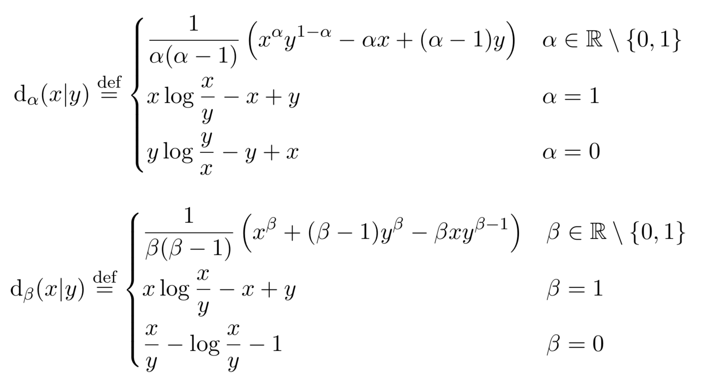

# Math tool: NMF

This Julia package implements multiple variants of the Non-Negative Matrix factorisation algorithm. Letting **X** be a non-negative matrix of dimensions having F rows and N columns, NMF aims at solving the following optimization problem

where the divergence function d is the element-wise &alpha; or &beta; divergence

More details available in the nmf.pdf document of docs folder.

# 1. NMF algorithms

The following set of algorithms are currently implemented. 

## Multiplicative updates (MU) algorithms 

- **Alpha divergence**

    1. A.Cichocki, S.Amari, R.Zdunek, R.Kompass, G.Hori, and Z.He, "
	Extended SMART algorithms for non-negative matrix factorization," Artificial Intelligence and Soft Computing, 2006.
	[url](https://link.springer.com/chapter/10.1007/11785231_58)

    Code implementing t

- **Beta divergence** 
	
    1. A.Cichocki, S.Amari, R.Zdunek, R.Kompass, G.Hori, and Z.He, "
    Extended SMART algorithms for non-negative matrix factorization," Artificial Intelligence and Soft Computing, 2006.

    2. C.Fevotte, J.Idier, 
    Algorithms for nonnegative matrix factorization with the beta-divergence, Neural Computation, 2011.

- **mu_mod**: Modified multiplicative upates (MU) Reference: C.-J. Lin, "On the convergence of multiplicative update
algorithms for nonnegative matrix factorization," IEEE Trans. Neural Netw. vol.18, no.6, pp.1589?1596, 2007.
